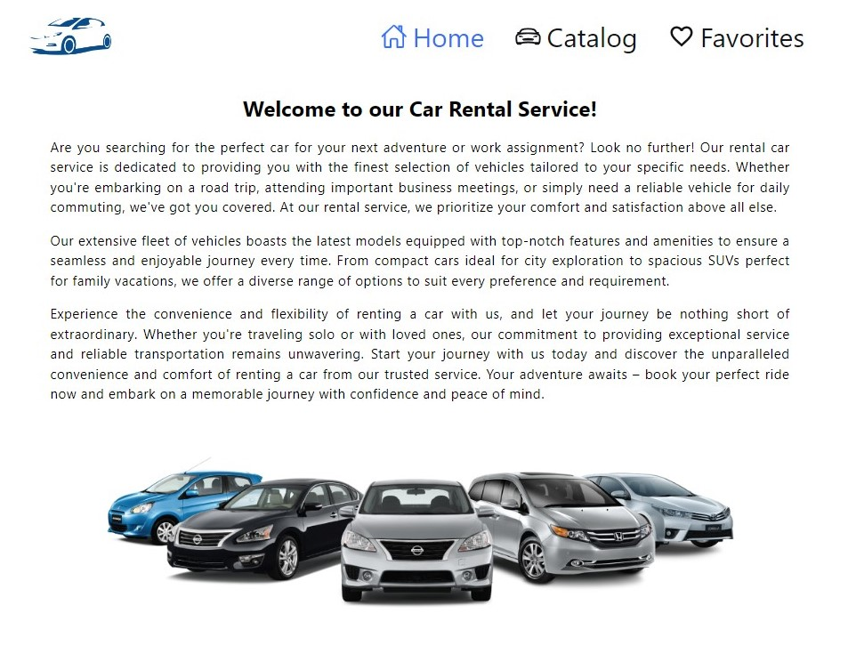
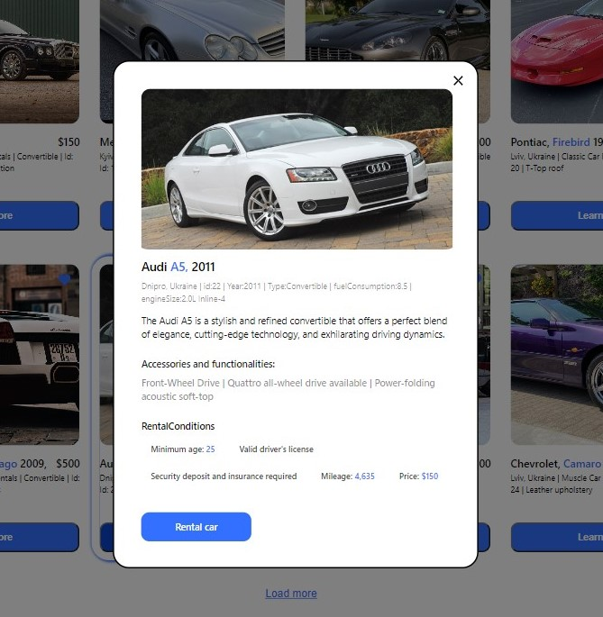
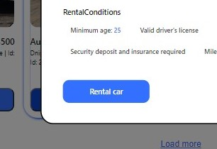
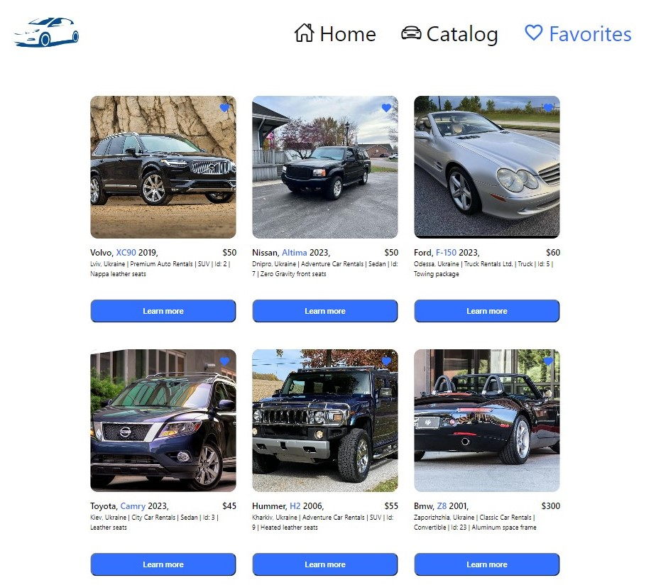

## Rental Cars


This is a web application for a company that provides car rental services in Ukraine. The application includes a home page with a description of services, a car catalog and a page with favorite ads.


## Features

 - **Car home page**. 
 
 - **Detailed information: Each ad contains detailed information about the car and rental conditions. Open a modal window for more information**.
 
 
 - **Phone number: Contact the company by phone number using the "Rental car" button**.

  - **Favorites page**.
  
## Deployment


Clone the repository to your computer.
To deploy this project run

```bash
  npm install
```
```bash
  npm start
```


## Tech Stack


**Server:** mockapi.io.


**HTML**, **CSS**, **JavaScript**, **Node.js**, **React.js**,


## Authors

- [NickPosvystak](https://github.com/NickPosvystak)